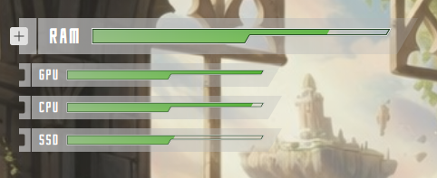

SAO HUD
=====

This app is a fan-based desktop HUD system monitor overlay for Linux, based on Sword Art Online.

It shows animated “SAO-style life bars” on your screen for RAM, GPU, CPU, and SSD usage.

When launched, it sits on the background of your display.
If toggled with the "+" button, it can float over your windows.

When the HUD is on top of the display, it is click-through and you can still use the other apps behind it.

Compatibility
-----

This app has been written to work on Nobara (Fedora 42) distribution.

It is made for Gnome (49) Wayland (using XWayland), but could be used by any system that has compatibility with X11 commands.

Installation
-----

1 - Download the files.

2 - Extract the files from the archive

3 - Move the sao-hud folder to /opt/

You may need to open the folder as admin.

4 - If you are on a Wayland system, you will need to run this command in the terminal to install XWayland :

    sudo dnf install -y xorg-x11-server-Xwayland

5 - Install all the dependencies with this command in the terminal :

    sudo dnf install -y python3-gobject python3-cairo gtk3 gtk3-devel \
    cairo-devel gobject-introspection-devel python3-pip lm_sensors

6 - Install the Python library with this command in the terminal :

    python3 -m pip install --user psutil

Launch at startup
-----

1 - Copy sao-hud.desktop (from the "utils" folder) to /home/YOUR_USERNAME/.config/autostart/

2 - Use the following command in the terminal to make it executable :

    chmod +x ~/.config/autostart/sao-hud.desktop

3 - Reconnect your user session to see the app launch at startup

Manual launch
-----

1 - Use the following commands in the terminal :

    cd /opt/sao-hud/

    GDK_BACKEND=x11 python3 main.py

Credits
-----

All credit goes to the original author of Sword Art Online : Reki Kawahara.
